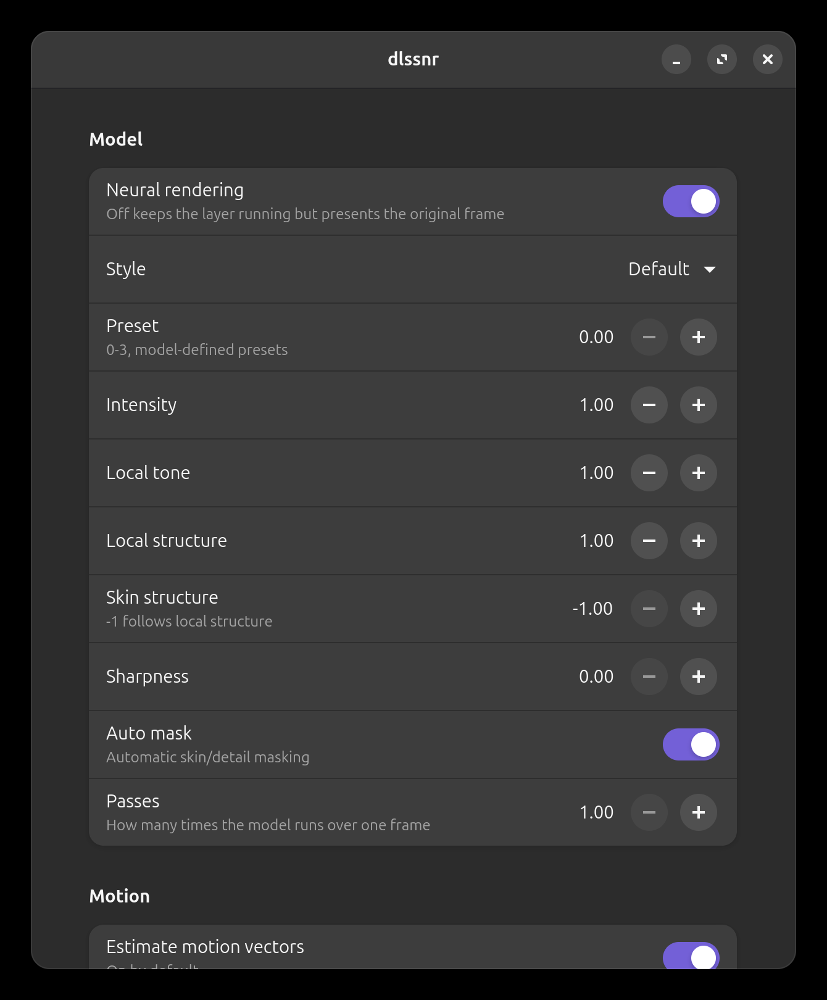

# dlssnr

A Linux Vulkan implicit layer plus Windows helper that forwards presented frames to
NVIDIA's DLSS 5 Neural Rendering model, running the model itself under Wine/Proton.
Written in Rust with GTK4 and libadwaita. A from-scratch rebuild of
[DLSS5VKLayer](https://github.com/bmitch87/DLSS5VKLayer)'s architecture, not a fork —
see [ATTRIBUTION.md](ATTRIBUTION.md) for exactly what that means and where the ideas
came from.

This is experimental, personal-use software. It works around an authorization check in
NVIDIA's proprietary NGX DLL to run the model outside its intended integration path —
see [Legal](#legal) before you use it.

## Screenshots

| Settings |
|---|
|  |

## What it does

- A Vulkan implicit layer hooks swapchain presentation for native Linux and Proton
  games and round-trips each frame to a helper process over shared memory.
- Fail-open: if the helper isn't running or the model fails to initialize, the layer
  just presents the original frame — nothing about the game's rendering depends on it.
- The Windows-side helper runs NVIDIA's `nvngx_dlssnr.dll` (Feature 18) under Wine or a
  Proton build, using synthetic motion vectors from `VK_NV_optical_flow` where the GPU
  supports it.
- HDR-aware capture: on an HDR swapchain the model sees a float16 proxy of the frame's
  real light (PQ-decoded first), not a tone-mapped 8-bit copy.
- A composition pass blends the model's output back into the frame — tone/structure/
  skin/sharpness controls, a reversible neutral-axis proxy mode, and a choice of
  resampling filters (Lanczos, Catmull-Rom, Mitchell-Netravali, Kaiser-windowed sinc)
  for the supersampling leg. This math is rederived independently from public sources,
  not ported from any GPL-licensed code — see ATTRIBUTION.md.
- GTK4/libadwaita settings app for all of the above, live-bound to the running layer
  over the same shared-memory segment.
- A CLI (`dlssnr-cli`) for runner discovery, starting/stopping the helper, status,
  diagnostics, importing the NVIDIA NGX DLLs, and raw settings introspection
  (`shmctl status`/`set`/`toggle`/`capture`) — no bash script, no root step.
- Everything lives under `~/.local/share`, `~/.config`, and `/tmp/dlssnr-$UID/`. No
  polkit, no pkexec, no privileged install step at all.

## Requirements

- x86_64 Linux, NVIDIA GPU and driver, Vulkan loader.
- A Wine install or a Steam compatibility tool that bundles DXVK-NVAPI (e.g.
  Proton-CachyOS, Proton-GE) to run the Windows-side helper. Valve's stock Proton
  builds don't bundle DXVK-NVAPI, so they aren't a supported runner.
- NVIDIA's own NGX DLLs, which this project doesn't and can't ship — see below.

## NVIDIA NGX DLLs

`nvngx_dlssnr.dll` is NVIDIA's proprietary model binary and isn't included here. Get it
from your own NVIDIA driver/SDK install and import it with:

```bash
dlssnr-cli import-binaries /path/to/dlls
```

or from the GUI's binaries import flow. Files are copied into
`$XDG_DATA_HOME/dlssnr/binaries`; restart the helper afterward.

## Install

Download the AppImage from [Releases](../../releases):

```bash
chmod +x dlssnr-*-x86_64.AppImage
./dlssnr-*-x86_64.AppImage
```

## Building from source

```bash
cargo build --release          # protocol, layer, gui, cli (native Linux)
cargo +stable build --release --target x86_64-pc-windows-gnu -p dlssnr-helper
./build-appimage.sh            # packs everything into an AppImage
```

Needs `mingw-w64` and the GTK4/libadwaita dev packages; see `build-appimage.sh` for the
exact package list. `CLAUDE.md` covers toolchain gotchas in detail if you're
cross-compiling the Windows helper on a machine with its own non-rustup Rust install.

## Legal

`nvngx_dlssnr.dll` checks which module is calling into it and refuses to run outside
its intended host application. The helper here spoofs that check (an IAT hook on the
caller-identity query) so the model will initialize at all under a generic Vulkan
helper process. That is a deliberate design choice, not an accident, and it likely
falls under DMCA §1201 (circumventing an access control) and/or breaches NVIDIA's NGX
EULA, depending on jurisdiction and how you use it. There's no license grant here for
that mechanism and none implied — use it at your own legal risk, for personal,
non-commercial use.

The composition/color pipeline in `crates/layer/src/composition/` is original work
rederived from public, permissively-licensed sources (see ATTRIBUTION.md); no
GPL-licensed code was read or ported to build it.

## License

This project's own code is MIT-licensed — see [LICENSE](LICENSE). It links against and
depends on NVIDIA's proprietary NGX SDK/DLLs at runtime, which are not covered by that
license and are not redistributed here.
